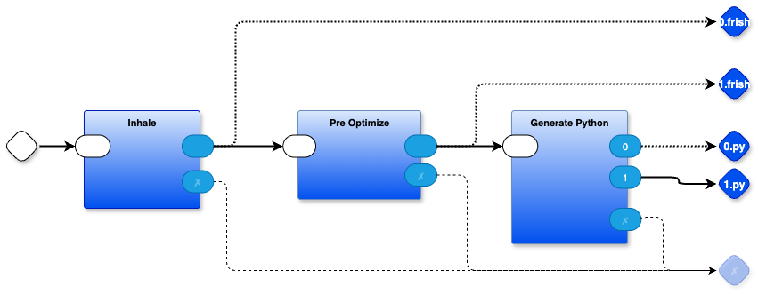

# STATUS
REPL seems to work in minimal testing.
Compiler appears to work, but calling compiled code fails at line 555 of `forthish.frish` (line 770 of `out.1.py`).

## To build: 

`make`

This builds the Python, then runs it, giving the `OK` prompt.

At the prompt, type `1 2 + .` and this prints 3.

At the next prompt, type `: plus + ;`, this compiles the `plus` word and gives a 3rd prompt `OK`.

At the 3rd prompt, type `2 3 plus` - this fails. [guess: compiler writes to RAM incorrectly, or, xinterpret
calls the compiled word incorrectly - TBD\.

Log of run, fail:

```
$ make
make
rm -f out.*
rm -f *.json
node pbp/das/das2json.mjs frish.drawio
Created: frish.drawio.json
./check-for-span-error.bash frish.drawio.json
python3 main.py . 'forthish.frish' main frish.drawio.json | node ./pbp/kernel/splitoutput.js
Created file: out.0.frish
Created file: out.1.frish
Created file: out.0.py
Created file: out.1.py
./run.bash out.1.py
OK 1 2 + .
1 2 + .
3
OK : plus + ;
: plus + ;
OK 2 3 plus
2 3 plus
Traceback (most recent call last):
  File "/Users/paultarvydas/projects/forthish-git/frishcomp/out.1.py", line 892, in <module>
    ok()                                                   #line 653#line 654
    ^^^^
  File "/Users/paultarvydas/projects/forthish-git/frishcomp/out.1.py", line 866, in ok
    xinterpret()                               #line 631#line 632#line 633#line 634#line 635
    ^^^^^^^^^^^^
  File "/Users/paultarvydas/projects/forthish-git/frishcomp/out.1.py", line 830, in xinterpret
    State.RAM [ xt]()
  File "/Users/paultarvydas/projects/forthish-git/frishcomp/out.1.py", line 770, in doword
    State.RAM [ State.W]()                         #line 555#line 556
    ^^^^^^^^^^^^^^^^^^^^^^
TypeError: 'int' object is not callable
make: *** [main] Error 1
$ 
```


# README

This directory contains a version of simple.py written in a PML - Portable Meta Language. 

The PML is called `frish`.

`Simple.py` written in `frish` can be found in `forthish.frish`. It uses a superset of ASCII called Unicode to avoid overloading the meaning of some characters and to break old habits found in most modern programming languages.

# Frish to Python Transmogrifier
The source code for the transmogrifier is written in PBP (Parts Based Programming).

You can view the source code by loading frish.drawio into the draw.io editor. (You can hack on it, too, if you wish).

The top level of the source code is



The process for transmogrifying `forthish.frish` consists of 3 main steps
1. read the source code `forthish.frish` and convert it into internal form 
   - the conversion is done using t2t (text-to-text transpilation). This uses a grammar `internalize.ohm` to pattern match the incoming code. Then, it uses rewrite rules `internalize.rwr` to actually perform the conversion to internal form. The internal form, in this simple example, isn't much - we just recognize newlines, count them, and insert tokens into the code stream for tracking source lines related to generated code lines. This is kind of like the `#line` directive in C compilers. The inserted tokens are of the form `⎩...⎭\n`, ie. unicode brackets wrapping an integer. The line numbers are tracked in `support.mjs` and the current line number is interpolated using the `rwr` syntax `⎨getlineinc⎬` (which returns the line number as a string, and increments the line counter).
   - This conversion doesn't do much in this example, but is an indicative place-holder for what might be done in larger projects
2. pre-optimize
   - more text-to-text transpilation done with `preopt.ohm` and `preopt.rwr`.
   - again, this isn't very exciting in this small example, but indicative of what could be done in larger projects
   - the pre-optimizer uses a _peephole_ technique - it pattern matches incoming code phrases and replaces them with "better" phrases
   - _peepholing_ has traditionally been done on assembler code based on a line-oriented basis, but, we can extend this idea using a PEG based parser like OhmJS
   - using OhmJS, we can match source code that is structured, recursive and arbitrarily crosses many lines
   - the pre-optimizer rewrite rules use the command `⎨xcontinue⎬` to cause the pre-optimizer to re-parse the rewritten code, much like a Lisp macro expander
	 - first, we find `deftemp` clauses that match a certain pattern (`deftemp i ⇐ %toint(word)` - literally in this simple example) then replace that particular phrase with a `defsynonym` phrase (literally `defsynonym i ≡ %toint (word)`) and tell the pre-optimizer to try again
	 - the first time through, we don't match any `defsynonym` phrases, but, the second time through, we find `defsynonym i ≡ %toint (word)`
and replace it some more with `defsynonym i ≡ %toint(word) ⎩NNNN⎭ %push(i)`, which produces "better" Python code downstream
	- also, we look for `if ... { pass } else { ... }` and invert the sense of the `if` statement, removing the redundant `pass` statement - again, not rocket science, but indicative of better things to might come in the future...
	- we do this on a character by character basis, looking ahead to see if any of the 3 patterns match. In 1980, this would have been deemed to be too inefficient, but it's not 1980 any more. If none of the patterns match, we leave the character alone and just emit it then move on to the next character, until we hit the end of the input.
3. generate Python code
   - t2t, again
   - the grammar `frish.ohm` contains much more than is needed for this example - I stole the code from a larger project (the PBP kernel)
   - the rewrite rules `emitpython.rwr` matches up one rewrite rule for every grammar rule - again, there's more here than is needed for this simple example - I stole the rewrite rules from the other project and just hacked on a few rules to do what I wanted for this example, leaving the rest just sitting there untouched and unused - feel free to clean it up ...
   - the emitter produces 2 outputs (1) dumb, non-optimized Python code, and, (2) "better" Python code that has been peepholed. This time, the peepholer is specifically tuned for Python. Even this simple example uses peepholing twice. At this point in the pipeline, we use `peephole_py.ohm` and `peephole_py.rwr` to replace silly phrases of code with less-silly phrases of code. For example, the `notnot` peephole rule removes the redundant pair of `nots`. Generating code in this way - generate dumb code, then make it less dumb - reduces cognitive load and de-tangles the issues of generating code from optimizing code.
   - at this point in time, I won't expend the effort to describe what the other rewrite rules do - if you can't figure them out, contact me on the forth-ish discord https://discord.gg/sKTdyBdK7A for discussion and further explanation (and possible inclusion in this `README.md`)

# Usage
`make`

## What does the Makefile do?
There are 3 steps
1. Convert the diagram to JSON using `pbp/das/das2json.mjs`. 
   - This mostly consists of stripping noise out of the .drawio file, e.g. the huge volume of graphics-rendering-only information, leaving only semantically interesting information
   - using dictionaries and code to inference which ports belong to which parts - not rocket science (this _is_ written in javascript :-)
   - building wiring tables - again not rocket science
2. Run the transmogrifier
   - this uses the JSON file plus a few bits of `.py` code to run the transmogrifier (this begins with `main.py` and imports `pbp/kernel/kernel0d.py` to deal with the JSON "graph")
3. unconvert the intermediate form into legal Python code 
   - turn internal line numbers into legal Python comments
   - indent the code according to Python requirements using the tiny program `indenter.mjs` (the internal form uses unicode bracket symbols `⤷` and `⤶` to generate code using bracketing notions that are more easily accepted by current parsing technologies - we need to unfold this stuff into legal Python indentation before asking Python to run the code 
   - again, not rocket science (the goal is to make this so easy that it could be done in only a few hours, and not to be a multi-month project which would be avoided)
   
